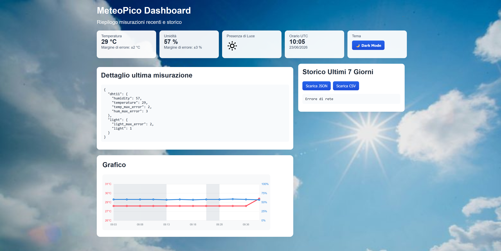

# 🌦️ MeteoPico

MeteoPico è una stazione meteo basata su **Raspberry Pi Pico W** che rileva temperatura, umidità e luminosità tramite sensori collegati al microcontrollore.

Il dispositivo mette a disposizione un'interfaccia web locale per la configurazione iniziale della rete Wi-Fi e, una volta connesso, diventa un piccolo server accessibile dalla rete locale.

---

## ✨ Funzionalità

* 🌡️ Rilevazione di temperatura e umidità
* ☀️ Rilevazione della luminosità ambientale
* 📡 Configurazione Wi-Fi tramite Access Point
* 🌐 Dashboard web locale
* 🔌 API HTTP integrate
* ⚙️ Configurazione dei pin tramite file JSON
* 🔒 Nessun invio di dati personali o di telemetria

---

## 📋 Sensori supportati

| Sensore           | Pin predefinito |
| ----------------- | --------------- |
| DHT11             | 15              |
| Light Sensor (DO) | 14              |

I pin possono essere modificati modificando il file:

```text
~/pico/data/sensors.json
```

---

## 🚀 Primo avvio

Al primo avvio MeteoPico entrerà automaticamente in modalità **Access Point**.

1. Collegarsi alla rete Wi-Fi generata dal dispositivo (SSID=PicoConfig, Password=12345678).
2. Aprire il browser e visitare:

```text
http://IP_DEL_DISPOSITIVO/wifi.html
```

3. Inserire SSID della rete Wi-Fi domestica.
4. Inserire la password.
5. Salvare la configurazione.

Dopo la connessione alla rete riavviare il Pico e MeteoPico sarà raggiungibile come server web locale tramite l'indirizzo IP assegnato dal router.

---

## 📁 Struttura del progetto

### `pico/`

Contiene il firmware e tutti i file da caricare sul Raspberry Pi Pico.

### `server/`

Contiene risorse statiche (icone, immagini e altri file condivisi) da pubblicare su un server web esterno.

Questa soluzione riduce l'utilizzo della memoria del microcontrollore mantenendo il firmware più leggero.

> ⚠️ **Privacy**
>
> MeteoPico **non invia dati personali né dati di telemetria** al server esterno.
> Il dispositivo scarica esclusivamente risorse statiche comuni (icone, immagini, ecc.).

Per utilizzare un server personale:

1. Caricare il contenuto della cartella `server/` sul proprio server web.
2. Aggiornare l'URL del server nei file presenti nella cartella `public/`.

Per impostazione predefinita viene utilizzato l'hosting GitHub contenente la cartella `server` di questo repository.

---

## 🔌 API

MeteoPico espone una serie di API HTTP utilizzabili da applicazioni esterne.

La documentazione completa è disponibile nel file:

API.md

---

## 💾 Firmware

Il firmware da caricare sul Raspberry Pi Pico si trova nella directory:

```text
~/pico/
```

---

## 📝 Note

* Assicurarsi che i sensori siano collegati correttamente prima dell'avvio.
* Il sensore **DHT11** rileva temperatura e umidità.
* Il sensore di luminosità supporta esclusivamente l'uscita digitale (**DO**).
* Se si modificano i file nella cartella `public/`, tenere presente che il server integrato può servire file di circa **4,3 KB** al massimo.

---

# Crediti

### Background

Foto `server/images/background.jpg` di <a href="https://unsplash.com/it/@chuttersnap?utm_source=unsplash&utm_medium=referral&utm_content=creditCopyText">CHUTTERSNAP</a> su <a href="https://unsplash.com/it/foto/cielo-nuvoloso-bianco-e-azzurro-TSgwbumanuE?utm_source=unsplash&utm_medium=referral&utm_content=creditCopyText">Unsplash<a>

### Icone

Le icone presenti nella cartella `server/icons/` sono tratte da **Boxicons**.
